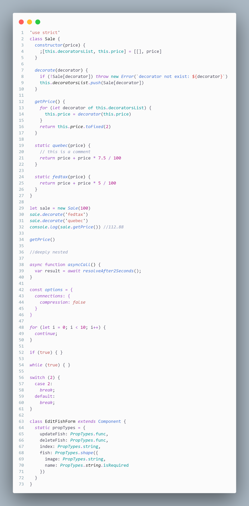

# Dark Night Rises 

A Visual Studio Code theme for the dark nights out there. Fine-tuned for those of us who like to code late into the night. Color choices have taken into consideration what is accessible to people with colorblindness and in low-light circumstances. Decisions were also based on meaningful contrast for reading comprehension and for optimal razzle dazzle. ✨

As of 1.0.0, there's a Light Dark Theme too! Color balanced from the Dark version for easy viewing in daylight. 🌅

About this theme, and some of the considerations made while creating it (as well as _how_ to create it should you want to make your own): [https://css-tricks.com/creating-a-vs-code-theme/](https://css-tricks.com/creating-a-vs-code-theme/)

## Light No Italics


## Dark Italics


## Light No Italics


## Light Italics



# Installation

1.  Install [Visual Studio Code](https://code.visualstudio.com/)
2.  Launch Visual Studio Code
3.  Choose **Extensions** from menu
4.  Search for `dark night rises`
5.  Click **Install** to install it
6.  Click **Reload** to reload the Code
7.  From the menu bar click: Code > Preferences > Color Theme > **Dark Night Rises**

## Disable Italics

If you wish to disable italics, there is now a no-italic theme available. You will have access to both, select **Dark Night Rises No Italics** as your color theme.

## Other versions

The community is awesome and has ported this theme over to other environments.

#### Dark Theme

- Hyper: [https://github.com/pbomb/hyper-night-dark](https://github.com/pbomb/hyper-night-dark)
- iTerm2
  1.  [https://github.com/nickcernis/iterm2-night-dark](https://github.com/nickcernis/iterm2-night-dark)
  2.  [https://github.com/jsit/night-dark-iterm2-theme](https://github.com/jsit/night-dark-iterm2-theme)
  3.  [https://github.com/florianeckerstorfer/night-dark-itermcolors](https://github.com/florianeckerstorfer/night-dark-itermcolors)
  4.  [https://github.com/andrewfluck/night-dark-iterm2](https://github.com/andrewfluck/night-dark-iterm2)
- Xresources: [https://github.com/alochaus/night-dark-xresources-theme](https://github.com/alochaus/night-dark-xresources-theme)
- Atom: [https://atom.io/themes/night-dark-vs-code-syntax](https://atom.io/themes/night-dark-vs-code-syntax)
- Jetbrains: [https://github.com/xdrop/night-dark-jetbrains](https://github.com/xdrop/night-dark-jetbrains)
- Emacs: [https://github.com/aaronjensen/night-dark-emacs](https://github.com/aaronjensen/night-dark-emacs)
- Vim
  1. [https://github.com/Khaledgarbaya/night-dark-vim-theme](https://github.com/Khaledgarbaya/night-dark-vim-theme)
  2. [https://github.com/haishanh/night-dark.vim](https://github.com/haishanh/night-dark.vim)
- Pygments [https://github.com/liamdawson/nightdark-pygments-style](https://github.com/liamdawson/nightdark-pygments-style)
- Alfred: [https://github.com/jbharat/night-dark-alfred-theme](https://github.com/jbharat/night-dark-alfred-theme)
- Ulauncher: [https://github.com/christoph-fricke/ulauncher-night-dark-theme](https://github.com/christoph-fricke/ulauncher-night-dark-theme)
- TextMate [https://github.com/batpigandme/night-darkish](https://github.com/batpigandme/night-darkish/tree/master/tmTheme)
- Ace Editor [https://github.com/batpigandme/night-darkish](https://github.com/batpigandme/night-darkish/tree/master/aceTheme)
- RStudio [https://github.com/batpigandme/night-darkish](https://github.com/batpigandme/night-darkish/tree/master/rstheme)
- Insomnia [https://github.com/yoannfleurydev/insomnia-plugin-night-dark-theme](https://github.com/yoannfleurydev/insomnia-plugin-night-dark-theme)
- Sublime Text 3 [https://github.com/VonHeikemen/night-dark-sublime-scheme](https://github.com/VonHeikemen/night-dark-sublime-scheme)
- Slack [https://github.com/clouby/night-dark-slack](https://github.com/clouby/night-dark-slack)
- Xcode [https://github.com/stealthanthrax/xcode-Night-Dark](https://github.com/stealthanthrax/xcode-Night-Dark)
- Visual Studio 2019: [https://github.com/kai-oswald/NightDark-VS-Theme](https://github.com/kai-oswald/NightDark-VS-Theme)
- Prism [https://github.com/SaraVieira/prism-theme-night-dark](https://github.com/SaraVieira/prism-theme-night-dark)
- Windows Terminal [https://github.com/edurojasr/Windows_Terminal_Theme_Night_Dark](https://github.com/edurojasr/Windows_Terminal_Theme_Night_Dark)
- Alacritty: [https://github.com/alacritty/alacritty](https://github.com/alacritty/alacritty/wiki/Color-schemes)

#### Light Theme

- iTerm2: [https://github.com/fcaldera/night-dark-light-iterm2](https://github.com/fcaldera/night-dark-light-iterm2)
- Vim: [https://github.com/macguirerintoul/night_dark_light.vim](https://github.com/macguirerintoul/night_dark_light.vim)
- Tilix: [https://github.com/johanhammar/light-dark-tilix](https://github.com/johanhammar/light-dark-tilix)
- Alacritty: [https://github.com/nik27/night-dark-alacritty-theme](https://github.com/nik27/night-dark-alacritty-theme)

## Separate the Editor from the Sidebar

This theme uses contrast sparingly so that when it's applied, it's more meaningful. This can help reduce noise and improve your ability to scan. However, some of the decisions may not work for everyone. One such decision that some disagree on is whether or not to have a separation between the editor and sidebar, and the amount of contrast. If you wish for this to have more visual signifigance, please paste this into your user settings preferences. These are my recommendations for these settings but you can use whatever colors you wish. ☺️

```
"workbench.colorCustomizations": {
  "[Dark Night Rises]": {
    "activityBar.background": "#000C1D",
    "activityBar.border": "#102a44",
    "editorGroup.border": "#102a44",
    "sideBar.background": "#001122",
    "sideBar.border": "#102a44",
    "sideBar.foreground": "#8BADC1"
  },
  "[Dark Night Rises (No Italics)]": {
    "activityBar.background": "#000C1D",
    "activityBar.border": "#102a44",
    "editorGroup.border": "#102a44",
    "sideBar.background": "#001122",
    "sideBar.border": "#102a44",
    "sideBar.foreground": "#8BADC1"
  }
},
```

## Preferences shown in the preview

The font in the preview image is Dank Mono, [available here](https://dank.sh/). Editor settings to activate font ligatures:

```
"editor.fontFamily": "Dank Mono",
"editor.fontLigatures": true,
```

The preview image is using [Bracket Pair Colorizer](https://marketplace.visualstudio.com/items?itemName=CoenraadS.bracket-pair-colorizer), a really cool extension that highlights matching brackets. This can help reduce unwanted errors.

I use this setting:

```
"bracketPairColorizer.forceIterationColorCycle": true,
```


## Misc

This is my first foray into creating a theme, so if you see something amiss, please feel free to [file an issue](https://github.com/Ian-Balijawa/dark-night-rises/issues)! I'm sure there are things I missed.

Any relevant changes for each version are documented in the changelog. Please update and check the changelog before filing any issues, as they may have already been taken care of.

This palette was inspired in part by Material Palenight [Theme](https://marketplace.visualstudio.com/items?itemName=whizkydee.material-palenight-theme), and the accessibility idea was inspired in part by Solarized [Themes](http://ethanschoonover.com/solarized)
